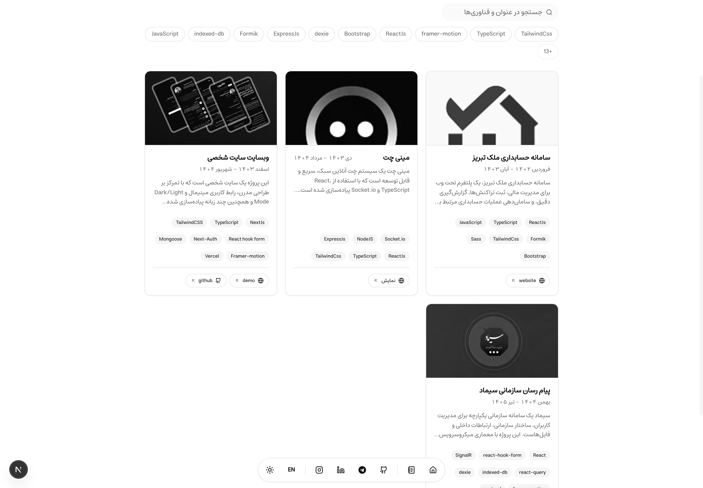
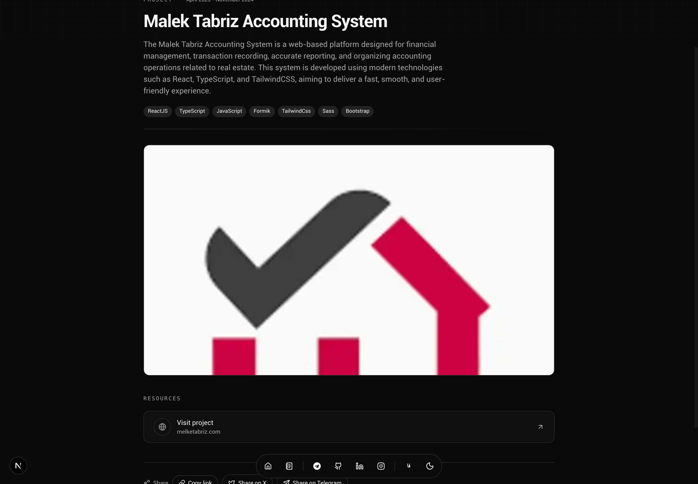
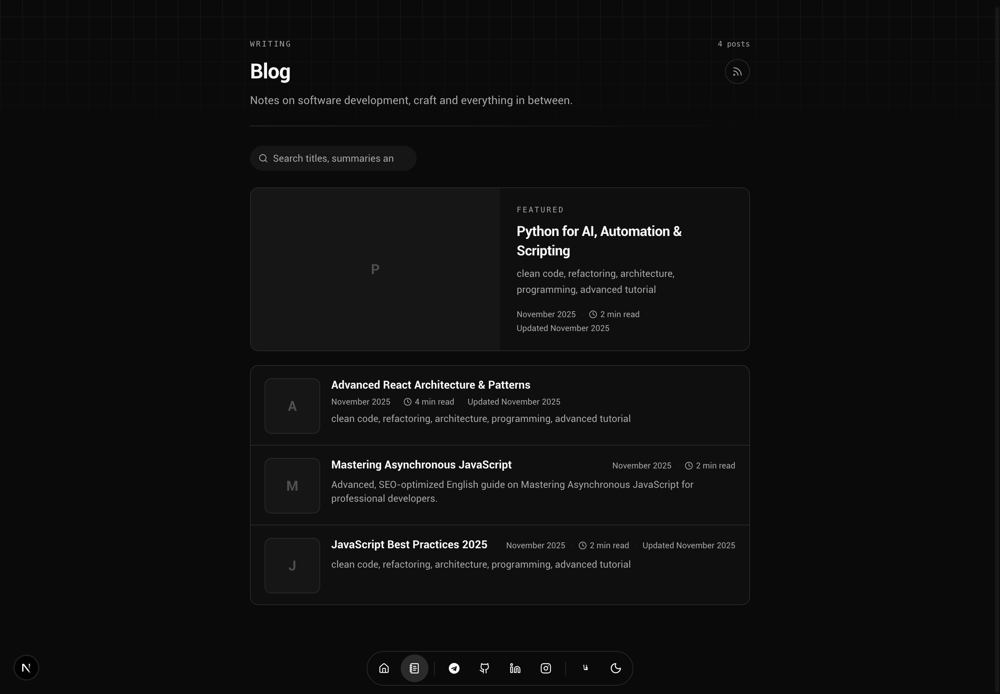
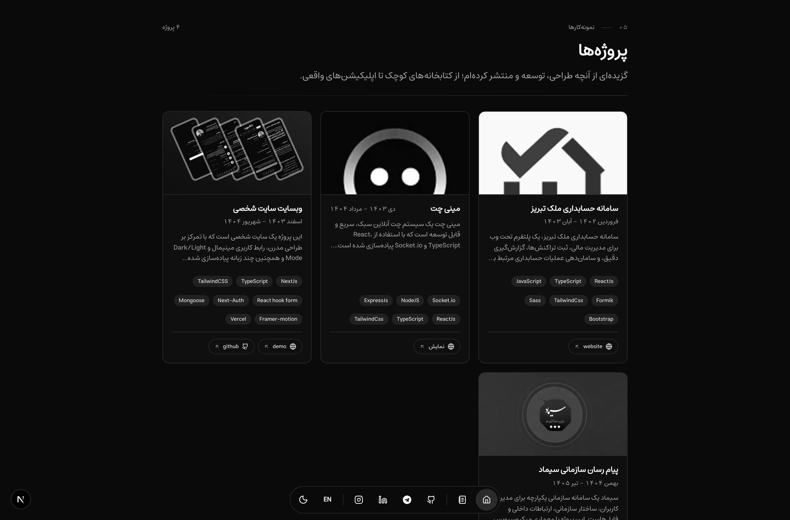
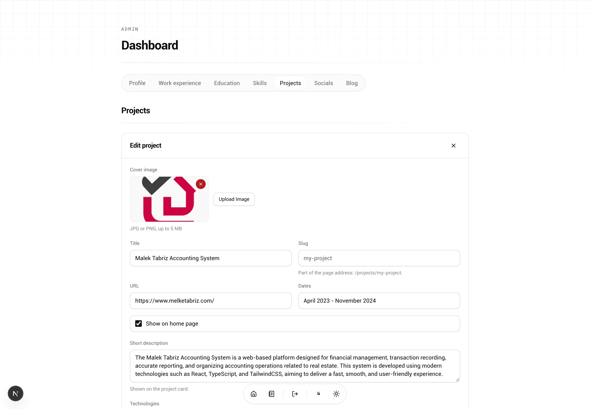
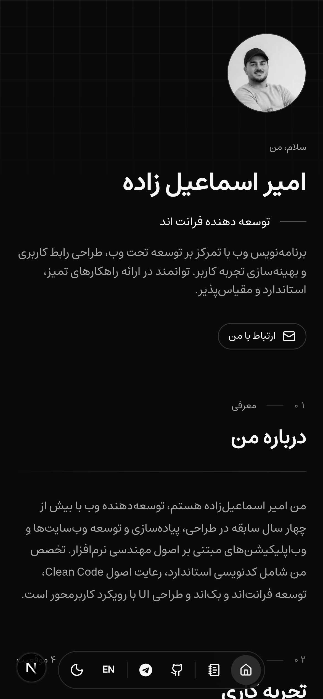

<div align="center" dir="rtl">

# مژیک پورتفولیو نکست

**وب‌سایت نمونه‌کار مینیمال و دوزبانه (فارسی/انگلیسی) با وبلاگ مارک‌داون، داشبورد مدیریت کامل و استقرار با یک کلیک روی Vercel — ساخته‌شده با Next.js 16، TypeScript، Tailwind CSS، shadcn/ui، MongoDB و next-intl.**


[](https://nextjs.org)
[](https://www.typescriptlang.org/)
[](https://tailwindcss.com)
[](https://ui.shadcn.com)
[](https://www.mongodb.com)
[](LICENSE)

[فارسی](README.fa.md) · [English](README.md) · [راه‌اندازی سریع](#راه‌اندازی-سریع-۵-دقیقه) · [استقرار روی Vercel](#استقرار-روی-vercel)

</div>

---

نمونه‌کاری که مثل یک صفحه‌ی چاپی خوانده می‌شود: یک پالت کاملاً سیاه‌وسفید، یک ریتم ثابت برای تیترها و یک اندازه‌ی یکسان برای همه‌ی کارت‌ها — به انگلیسی و فارسی، از یک مخزن کد. هر آنچه می‌بینید داده‌ای است که در داشبورد ویرایش می‌کنید؛ چیزی به‌صورت دستی در کد نوشته نشده است.

## فهرست مطالب

- [آنچه در این پروژه است](#آنچه-در-این-پروژه-است)
- [نمای کلی](#نمای-کلی)
- [راه‌اندازی سریع (۵ دقیقه)](#راه‌اندازی-سریع-۵-دقیقه)
- [اسکریپت‌ها](#اسکریپت‌ها)
- [متغیرهای محیطی](#متغیرهای-محیطی)
- [محتوای نمونه](#محتوای-نمونه)
- [ساختار پروژه](#ساختار-پروژه)
- [تصمیم‌های فنی](#تصمیم‌های-فنی)
- [سامانه‌ی طراحی](#سامانه‌ی-طراحی)
- [سئو و داده‌ی ساختاریافته](#سئو-و-داده‌ی-ساختاریافته)
- [شخصی‌سازی](#شخصی‌سازی)
- [استقرار روی Vercel](#استقرار-روی-vercel)
- [عیب‌یابی](#عیب‌یابی)
- [مشارکت](#مشارکت)
- [پروانه](#پروانه)

## آنچه در این پروژه است

| بخش | توضیح |
| --- | --- |
| **سایت عمومی** | معرفی، درباره، سوابق کاری، تحصیلات، مهارت‌ها، پروژه‌ها و تماس — به‌علاوه‌ی آرشیو پروژه با جستجو و فیلتر فناوری، صفحه‌ی اختصاصی هر پروژه، وبلاگ با برچسب و پیش‌نویس، و فید RSS. کدام پروژه‌ها در صفحه‌ی اصلی باشند هم از داشبورد انتخاب می‌شود. |
| **داشبورد مدیریت** | همه‌ی محتواها در `/{locale}/dashboard`: پروفایل، سوابق کاری، تحصیلات، مهارت‌ها، پروژه‌ها، شبکه‌های اجتماعی و ویرایشگر Markdown وبلاگ. اعتبارسنجی، حالت بارگذاری، خطا و خالی در همه‌جا؛ همراه با بارگذاری تصویر و برش در مرورگر. |
| **دوزبانه با RTL واقعی** | انگلیسی پیش‌فرض (`/`) و فارسی (`/fa`) با آینه‌شدن آیکون‌ها و فلش‌ها، اعداد فارسی، تاریخ جلالی و تایپوگرافی تنظیم‌شده برای خط فارسی. |
| **رابط کاملاً سیاه‌وسفید** | توکن‌های shadcn/ui، پوسته‌ی روشن و تاریک، و انیمیشن‌های ظاهرشدن فقط با CSS که `prefers-reduced-motion` را رعایت می‌کند. |
| **امن به‌صورت پیش‌فرض** | همه‌ی APIهای مدیریتی نیازمند نشست هستند؛ نام کاربری و رمز عبور فقط در متغیرهای سمت سرور و بدون حساب نمونه؛ بدنه‌ی همه‌ی درخواست‌ها با Zod در سرور اعتبارسنجی می‌شود. |
| **سئوی کامل** | متادیتای هر صفحه، canonical و hreflang، Open Graph و Twitter با تصویر OG تولیدشده، JSON-LD، نقشه‌ی سایت محلی‌سازی‌شده، robots، فید RSS و manifest. |
| **کاملاً تایپ‌شده** | TypeScript سخت‌گیر، تایپ‌های مشترک دامنه، مدل‌های Mongoose، ESLint و یک دروازه‌ی کیفیت: `npm run verify`. |

## نمای کلی

<table dir="rtl">
  <tr>
    <td width="50%">
      <br />
      <sub><b>آرشیو پروژه</b> — جستجوی آنی، چیپ‌های فناوری و سه کارت در هر ردیف.</sub>
    </td>
    <td width="50%">
      <br />
      <sub><b>صفحه‌ی پروژه</b> — نشانی اختصاصی، متن کامل، پیوندهای منبع و ناوبری قبلی/بعدی.</sub>
    </td>
  </tr>
  <tr>
    <td width="50%">
      <br />
      <sub><b>وبلاگ</b> — نوشته‌ی برگزیده، فیلتر برچسب، زمان مطالعه و مخفی‌بودن پیش‌نویس‌ها در سایت عمومی.</sub>
    </td>
    <td width="50%">
      <br />
      <sub><b>فارسی و راست‌به‌چپ</b> — همان چیدمان به‌صورت آینه‌ای، با تاریخ جلالی و اعداد فارسی.</sub>
    </td>
  </tr>
  <tr>
    <td width="50%">
      <br />
      <sub><b>داشبورد</b> — با ویرایش هر آیتم، پنل فرم بالای فهرست باز و به نمای آورده می‌شود.</sub>
    </td>
    <td width="50%">
      <br />
      <sub><b>واکنش‌گرا</b> — یک ستون در موبایل و نوار شناور به‌جای منوی کامل.</sub>
    </td>
  </tr>
</table>

## راه‌اندازی سریع (۵ دقیقه)

پیش‌نیازها: **Node.js نسخه‌ی ۲۰ یا بالاتر** و یک دیتابیس MongoDB (نصب لوکال یا کلاستر رایگان [MongoDB Atlas](https://www.mongodb.com/atlas)).

```bash
# ۱. کلون و نصب وابستگی‌ها
git clone https://github.com/emiroow/magic-portfolio.git
cd magic-portfolio
npm install

# ۲. تنظیم متغیرهای محیطی
cp .env.example .env.local
# مقادیر MONGODB_URI، NEXTAUTH_SECRET، ADMIN_EMAIL و ADMIN_PASSWORD را وارد کنید

# ۳. بارگذاری محتوای نمونه (اختیاری، پیشنهاد می‌شود)
npm run seed                 # شخصیت پیش‌فرض: frontend
npm run seed -- --persona=backend --force   # انتخاب شخصیت دیگر، با بازنشانی دیتابیس

# ۴. اجرای سرور توسعه
npm run dev
```

نشانی [http://localhost:3000](http://localhost:3000) را باز کنید؛ سایت از همان‌جا `/en` و `/fa` را سرو می‌کند.
داشبورد در `/fa/dashboard` در دسترس است و با همان `ADMIN_EMAIL` و `ADMIN_PASSWORD` وارد می‌شوید — اگر این متغیرها تنظیم نشده باشند، ورود کلاً رد می‌شود.

## اسکریپت‌ها

| اسکریپت              | کاربرد                                            |
| -------------------- | ------------------------------------------------- |
| `npm run dev`        | اجرای سرور توسعه                                  |
| `npm run build`      | بیلد پروداکشن                                     |
| `npm run start`      | اجرای بیلد پروداکشن                               |
| `npm run seed`       | درج محتوای نمونه (اگر دیتابیس خالی باشد)          |
| `npm run seed:force` | پاک کردن دیتابیس و سپس درج محتوای نمونه         |
| `npm run seed:list`  | فهرست شخصیت‌های نمونه و شمار محتوای هرکدام        |
| `npm run lint`       | ESLint                                            |
| `npm run typecheck`  | `tsc --noEmit`                                    |
| `npm run format`     | Prettier روی `src/**`                             |
| `npm run verify`     | لینت + تایپ‌چک + بیلد — همان دروازه‌ی CI           |

## متغیرهای محیطی

| متغیر                            | ضروری | توضیح                                                              |
| -------------------------------- | ----- | ------------------------------------------------------------------ |
| `MONGODB_URI`                    | بله   | رشته‌ی اتصال به MongoDB                                             |
| `NEXT_PUBLIC_SITE_URL`           | بله   | نشانی اصلی سایت (مثلاً `https://portfolio.example.com`)            |
| `NEXTAUTH_SECRET`                | بله   | کلید رمزنگاری نشست — با `openssl rand -base64 32` بسازید           |
| `NEXTAUTH_URL`                   | پروداکشن | همان نشانی اپلیکیشن (سازگاری NextAuth)                          |
| `ADMIN_EMAIL` / `ADMIN_PASSWORD` | بله   | اطلاعات ورود داشبورد — حساب نمونه یا پیش‌فرض وجود ندارد            |
| `BLOB_READ_WRITE_TOKEN`          | پروداکشن | توکن Vercel Blob؛ برای بارگذاری تصویر در پروداکشن لازم است     |
| `NEXT_PUBLIC_TWITTER_HANDLE`     | نه    | `@handle` برای Twitter cards                                        |
| `NEXT_PUBLIC_GA_ID`              | نه    | شناسه‌ی اختیاری Google Analytics 4                                  |
| `SEED_PERSONA`                   | نه    | شخصیت نمونه برای seed: `frontend`، `backend`، `fullstack`، `designer` |
| `SEED_IMAGES`                    | نه    | روی `false` که نشانی تصویرهای جانشین درج نشود                       |

> عنوان سایت و توضیح متا از متغیر محیطی نمی‌آیند؛ از مستند پروفایلی ساخته می‌شوند که در داشبورد ویرایش می‌کنید: `نام | عنوان شغلی | سایت شخصی`.

## محتوای نمونه

`npm run seed` سایت را با **یک شخصیت کاری** پر می‌کند: یک فرد داستانی که پروفایل، سوابق، پروژه‌ها، ابزارها، راه‌های ارتباطی و نوشته‌هایش همه یک داستان را روایت می‌کنند. با عوض کردن persona، همه‌ی بخش‌ها یکدست بازنویسی می‌شوند؛ می‌توانید مهندس فرانت‌اند، مهندس بک‌اند، توسعه‌دهنده فول استک یا طراح محصول را انتخاب کنید.

| Persona     | چه کسی                                                            |
| ----------- | ----------------------------------------------------------------- |
| `frontend`  | سارا میرزایی — مهندس فرانت‌اند، سیستم طراحی و کارهای RTL          |
| `backend`   | کیان رحمانی — مهندس بک‌اند، پرداخت و پایپ‌لاین رویداد              |
| `fullstack` | الکس کارتر — توسعه‌دهنده فول استک در تیم‌های محصول کوچک           |
| `designer`  | مینا رحیمی — طراح محصول، رابط، سیستم و موشن                      |

```bash
npm run seed:list                              # چه شخصیت‌هایی موجودند
npm run seed -- --persona=designer --force     # پاک کردن دیتابیس و seed همان شخصیت
SEED_IMAGES=false npm run seed                 # بدون تصویر جانشین؛ فقط مونوگرام‌های خود سایت
```

نکته‌هایی درباره چیزی که نوشته می‌شود:

- **هر دو زبان، یک‌جا.** هر رکورد در انگلیسی و فارسی به‌صورت موازی نوشته شده، از جمله تاریخ‌های جلالی در نسخه‌ی `/fa`.
- **پروژه‌ها case study هستند.** هر پروژه بدنه‌ی بلند Markdown، فلگ `featured` (سه مورد برای هر persona که سطر اول صفحه‌ی اصلی را می‌سازند) و `createdAt` صریح دارد تا ترتیب آرشیو و صفحه‌ی اصلی منطق باشد.
- **یک پیش‌نویس در وبلاگ هست.** برای هر persona یک نوشته منتشرنشده درج می‌شود تا حالت draft داشبورد دیده شود.
- **نوشته‌ی «درباره محتوای نمونه» اول می‌آید.** تازه‌ترین پست، هشداری است که محتوای این سایت ساختگی است تا کسی رقم‌های نمونه را واقعی حساب نکند.
- **همه چیز ساختگی است.** نام شرکت‌ها، نشانی‌ها، عددها و تصویرها placeholder‌اند (شخصیت‌های داستانی روی دامنه‌های `*.example.com` و تصویرها از سرویس نمونه‌ی picsum). از طریق `/dashboard` جایگزینشان کنید؛ هیچ‌کدام نقل‌قول‌پذیر نیستند.
- **شخصیت خودتان را اضافه کنید.** یک ماژول جدید در `src/seed/personas/` بسازید که `Persona` export کند و در `src/seed/personas/index.ts` ثبتش کنید — همه‌ی ماژول‌های seed از همان personaی که resolve شده می‌خوانند.

## ساختار پروژه

```
src/
├── app/
│   ├── [locale]/            # روت‌های محلی‌سازی‌شده (en پیش‌فرض، fa با RTL)
│   │   ├── (client)/        # صفحه‌ی اصلی (معرفی، درباره، سوابق، پروژه‌ها…)
│   │   ├── auth/            # ورود مدیر
│   │   ├── blog/            # فهرست وبلاگ، صفحه‌ی نوشته و مسیر RSS
│   │   ├── projects/        # آرشیو پروژه و صفحه‌ی /projects/[slug]
│   │   └── dashboard/       # داشبورد مدیریت (محافظت‌شده با نشست)
│   ├── api/
│   │   ├── [lang]/          # API عمومی JSON (داده‌های پروفایل و وبلاگ)
│   │   ├── [lang]/admin/    # APIهای مدیریتی CRUD + بارگذاری فایل
│   │   ├── auth/            # NextAuth
│   │   └── og/              # تولید تصویر Open Graph
│   └── layout.tsx           # فونت‌ها، متادیتای سراسری و آنالیتیکس
├── components/
│   ├── dashboard/           # بخش‌های داشبورد (یک فایل برای هر محتوا)
│   ├── sections/            # بخش‌های صفحه‌ی اصلی
│   ├── blog/ و projects/    # نمای فهرست‌ها
│   ├── magicui/             # انیمیشن ظاهرشدن
│   └── ui/                  # اجزای shadcn/ui و قطعات مشترک فهرست‌ها
├── config/                  # تنظیمات NextAuth و اتصال کش‌شده‌ی دیتابیس
├── constants/               # جدول مسیرها که داک و فوتر از آن خوانده می‌شوند
├── hooks/                   # هوک‌های react-hook-form و react-query
├── lib/                     # لایه‌ی داده، اسکیماهای Zod و ابزارها
├── models/                  # اسکیماهای Mongoose
├── seed/                    # محتوای نمونه (npm run seed)
│   └── personas/            # یک شخصیت داستانی برای هر persona، هر دو زبان
├── types/                   # تایپ‌های مشترک دامنه
└── i18n/                    # پیکربندی مسیرها و درخواست next-intl
```

## تصمیم‌های فنی

- **خواندن در سرور، نوشتن در کلاینت.** صفحه‌ها مستقیم از طریق `src/lib/data.ts` می‌خوانند (بدون self-fetch روی HTTP). API عمومی `/api/{lang}` هم برای سرویس‌های دیگر باز است و داشبورد با `/api/{lang}/admin/*` کار می‌کند.
- **یک کارخانه‌ی CRUD.** `src/lib/crud.ts` همه‌ی اندپوینت‌های مدیریتی را می‌سازد: بررسی نشست، اعتبارسنجی Zod، مدیریت اسلاگ، `revalidatePath` بعد از نوشتن و شکل یکسان خطاها.
- **محتوای محلی‌سازی‌شده، نه ترجمه‌شده.** هر مستند فیلد `lang` دارد؛ بنابراین نسخه‌ی فارسی و انگلیسی رکوردهای مستقل‌اند (متن، تاریخ و پروژه‌های متفاوت).
- **بارگذاری تصویر.** در توسعه داخل `public/{type}/{lang}` ذخیره می‌شود و در پروداکشن روی Vercel Blob؛ برش تصویر پیش از آپلود در مرورگر انجام می‌شود و پارامتر ضدکش فقط برای پیش‌نمایش است و در نشانی ذخیره‌شده نمی‌ماند.
- **جریان ویرایش.** هر بخش داشبورد یک پنل لغزان دارد: با باز شدن، بخش به نمای بالا می‌آید (پنل همیشه بالای فهرست است)، با ذخیره‌ی موفق بسته می‌شود، با `Escape` بسته می‌شود و اگر ذخیره رد شود باز می‌ماند تا چیزی از دست نرود.
- **انتخاب پروژه‌های صفحه‌ی اصلی.** گزینه‌ی `active` پروژه را در سایت منتشر می‌کند و `featured` آن را برای بخش پروژه‌های صفحه‌ی اصلی برمی‌گزیند؛ این بخش سه جای ثابت دارد. پروژه‌های برگزیده در صدر ردیف می‌ایستند و جای خالی با جدیدترین پروژه‌ی منتشرشده پر می‌شود، پس هرگز نیمه‌خالی نمی‌ماند؛ و اگر هیچ پروژه‌ای برگزیده نشده باشد، سه پروژه‌ی منتشرشده‌ی جدیدتر نمایش داده می‌شوند. این انتخاب را می‌توان با دکمه‌ی سنجاق در همان سطر پروژه (که بی‌درنگ ذخیره می‌کند و جای پروژه را نشان می‌دهد: «صفحهٔ اصلی · ۱») یا از پنل ویرایش انجام داد. شمارنده همیشه می‌گوید چند جا باقی مانده و هر کنترلی که کار نکند دلیلش را می‌گوید: پروژه‌ی منتشرنشده باید نخست منتشر شود و تا سه جای صفحه پر شده باشد، انتخاب چهارم ممکن نیست.
- **مدل داده.** `profile`، `work`، `education`، `skill`، `social`، `project` و `blog` در `src/models` و تایپ‌های متناظر در `src/types`. پروژه‌ها اسلاگ، متن کامل Markdown، برچسب فناوری، انتخاب برای صفحه‌ی اصلی و فهرست پیوندهای برچسب‌خورده دارند؛ نوشته‌های وبلاگ برچسب، تصویر جلد و وضعیت انتشار.

## سامانه‌ی طراحی

- **توکن‌های سیاه‌وسفید.** همه‌ی رنگ‌ها در متغیرهای CSS داخل `src/app/globals.css` هستند؛ تأکید هرگز با رنگ ساخته نمی‌شود، بلکه با ضخامت خط، تفاوت سطح و حالت hover معکوس.
- **یک زبان مشترک برای تیترها.** `SectionHeader` سطر شماره + سربرگ + شمارش آیتم، تیتر، توضیح اختیاری و خط باریکی که در جهت خواندن محو می‌شود را می‌سازد؛ بخش‌های صفحه‌ی اصلی و صفحه‌های مستقل هر دو از همان استفاده می‌کنند.
- **قطعات مشترک فهرست‌ها.** `ListingToolbar` (جستجو + چیپ‌های فیلتر)، `FilterChip`، `EmptyPanel` و `Stack` باعث می‌شوند آرشیو پروژه، وبلاگ و فهرست‌های داشبورد یک شکل باشند.
- **RTL شهروند درجه‌یک است.** از فاصله‌های فیزیکی استفاده نمی‌شود (`ps-*`/`pe-*` و `ms-*`/`me-*`)، فلش‌ها با `rtl:-scale-x-100` آینه می‌شوند، letter-spacing در RTL خنثی می‌شود چون پیوند حروف فارسی را می‌شکند، و تکه‌های لاتین داخل متن فارسی با `<bdi>` بسته می‌شوند تا ترتیب دوجهته درست بماند.
- **بی‌حرکتی هم رعایت می‌شود.** انیمیشن‌های ظاهرشدن با CSS (`reveal` / `reveal-view`) و رندر سمت سرور انجام می‌شوند، پس جاوااسکریپت انیمیشنی به کلاینت نمی‌رود و `prefers-reduced-motion` همه‌چیز را خاموش می‌کند.

## سئو و داده‌ی ساختاریافته

| سطح | جزئیات |
| --- | --- |
| متادیتا | عنوان و توضیح برای هر صفحه، canonical، `hreflang` برای هر دو زبان، Open Graph و Twitter card. |
| تصویر OG | `/api/og` برای هر صفحه و هر زبان تصویر ۱۲۰۰×۶۳۰ تولید می‌کند. |
| JSON-LD | `Person` و `BreadcrumbList` در صفحه‌ی اصلی، `CollectionPage` در فهرست‌ها، `SoftwareApplication` در صفحه‌ی پروژه، `Blog` و `BlogPosting` در نوشته‌ها. |
| کشف صفحه | `sitemap.ts` محلی‌سازی‌شده، `robots.ts`، فید RSS در `/blog/rss.xml` و manifest برای نصب‌پذیری. |
| ISR | صفحه‌های عمومی هر ساعت بازتأیید می‌شوند و با هر ویرایش در داشبورد `revalidatePath` اجرا می‌شود؛ تغییر فوری نمایش داده می‌شود. |

## شخصی‌سازی

- **رنگ‌ها** — متغیرهای CSS در `src/app/globals.css` تنها منبع تم سیاه‌وسفیدند.
- **محتوا** — همه‌چیز از MongoDB و از طریق داشبورد مدیریت می‌شود؛ با `npm run seed:force` محتوای نمونه بازنشانی می‌شود، یا با `--persona=<id>` شخصیت دیگری را انتخاب کنید (بخش [محتوای نمونه](#محتوای-نمونه)).
- **ناوبری** — نوار شناور، تولتیپ‌ها و فوتر داشبورد هر سه از `NavbarRoutes` در `src/constants/global.ts` خوانده می‌شوند؛ یک تغییر، هر سه را به‌روز می‌کند.
- **افزودن یک بخش** — مدل و تایپ در `src/models` و `src/types`، اندپوینت با `createAdminCrud` در `src/app/api/[lang]/admin/...`، خواندن داده در `src/lib/data.ts` و کامپوننت بخش در `src/components/sections`.
- **زبان‌ها** — ترجمه‌ها در `messages/en.json` و `messages/fa.json` و زبان‌ها در `src/i18n/routing.ts` تنظیم می‌شوند.

## استقرار روی Vercel

1. مخزن را روی GitHub قرار دهید.
2. در [Vercel](https://vercel.com/new) مخزن را import کنید.
3. متغیرهای محیطی را وارد کنید (جدول بالا)؛ برای دیتابیس از رشته‌ی اتصال **Atlas** استفاده کنید.
4. برای فعال‌بودن بارگذاری تصویر، یک فروشگاه [Vercel Blob](https://vercel.com/docs/storage/vercel-blob) بسازید — `BLOB_READ_WRITE_TOKEN` به‌صورت خودکار تزریق می‌شود.
5. استقرار را بزنید، سپس `NEXT_PUBLIC_SITE_URL` را روی دامنه‌ی نهایی تنظیم و یک بار دیگر deploy کنید تا متادیتا به‌روز شود.

در پروداکشن تصویرها روی Vercel Blob و در توسعه داخل `public/` ذخیره می‌شوند؛ برای کار محلی تنظیم اضافه‌ای لازم نیست.

## عیب‌یابی

| نشانه                                   | راه‌حل                                                                  |
| --------------------------------------- | ----------------------------------------------------------------------- |
| پیام «هنوز محتوایی وجود ندارد»          | `MONGODB_URI` اشتباه یا خالی است — `.env.local` را بررسی و `npm run seed` بزنید |
| تصویرها در پروداکشن کار نمی‌کنند        | `BLOB_READ_WRITE_TOKEN` را تنظیم کنید                                    |
| ورود بی‌پایان ریدایرکت می‌شود           | `NEXTAUTH_URL` باید دقیقاً با نشانی دیپلوی یکی باشد                      |
| ورود همیشه رد می‌شود                    | `ADMIN_EMAIL` و `ADMIN_PASSWORD` باید تنظیم شده باشند                   |
| تاریخ‌های فارسی میلادی نشان داده می‌شوند | Node نسخه‌ی ۲۰ یا بالاتر با ICU کامل لازم است                           |
| `npm run seed` فایل `.env.local` را پیدا نمی‌کند | ابتدا فایل `.env.local` را بسازید؛ اسکریپت seed به آن نیاز دارد   |

## مشارکت

بازگزارش مشکل و pull request خوش‌آمد است. پیش از ثبت، `npm run verify` را اجرا کنید — همان دروازه‌ای که CI اجرا می‌کند (لینت + تایپ‌چک + بیلد). زبان بصری پروژه را یکدست نگه دارید: توکن سیاه‌وسفید، تیترهای مشترک و فاصله‌گذاری سازگار با RTL.

## پروانه

[MIT](LICENSE) — آزاد برای استفاده در نمونه‌کار شخصی، پروژه‌ی تجاری و قالب‌های مشتق.
