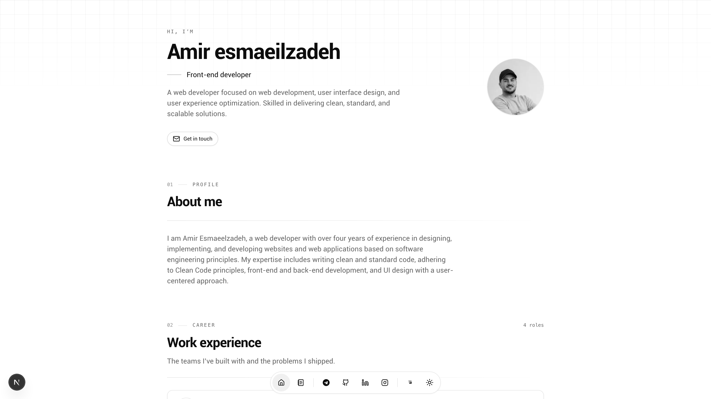

<div align="center">

# Magic Portfolio

**A minimal, bilingual (EN/FA) developer portfolio with a Markdown blog, a full admin dashboard and one-click Vercel deployment — built with Next.js 16, TypeScript, Tailwind CSS, shadcn/ui, MongoDB and next-intl.**



[](https://nextjs.org)
[](https://www.typescriptlang.org/)
[](https://tailwindcss.com)
[](https://ui.shadcn.com)
[](https://www.mongodb.com)
[](LICENSE)

[English](README.md) · [فارسی](README.fa.md) · [Quick start](#quick-start-5-minutes) · [Deploy on Vercel](#deploy-on-vercel)

</div>

---

A portfolio that reads like a printed page: one monochrome palette, one heading rhythm, one card measure — in English and Persian, from the same codebase. Everything you see is data you edit in the dashboard; nothing is hardcoded.

## Table of contents

- [What is in the box](#what-is-in-the-box)
- [Preview](#preview)
- [Quick start (5 minutes)](#quick-start-5-minutes)
- [Scripts](#scripts)
- [Environment variables](#environment-variables)
- [Project structure](#project-structure)
- [Architecture notes](#architecture-notes)
- [Design system](#design-system)
- [SEO and structured data](#seo-and-structured-data)
- [Customization](#customization)
- [Deploy on Vercel](#deploy-on-vercel)
- [Troubleshooting](#troubleshooting)
- [Contributing](#contributing)
- [License](#license)

## What is in the box

| Area | What you get |
| --- | --- |
| **Public site** | Hero, about, work experience, education, skills, projects, contact — plus a project archive with search and technology filters, project detail pages, a blog with tags, drafts and an RSS feed. Which projects the home page shows is a dashboard setting. |
| **Admin dashboard** | Every content type at `/{locale}/dashboard`: profile, work experience, education, skills, projects, socials and a Markdown blog editor. Validation, loading, error and empty states everywhere; image upload with in-browser cropping. |
| **Two languages** | English (default, `/`) and Persian (`/fa`) with real RTL: mirrored icons and arrows, Persian digits, Jalali (Solar Hijri) dates, and typography tuned for the Persian script. |
| **Strictly monochrome UI** | Black-and-white shadcn/ui tokens, light and dark themes, and CSS-only reveal animations that respect `prefers-reduced-motion`. |
| **Secure by default** | All admin APIs require a session; credentials live in server-only env vars with no demo or fallback accounts; every request body is validated with Zod on the server. |
| **SEO out of the box** | Per-page metadata, canonical + hreflang alternates, Open Graph / Twitter cards with a generated OG image, JSON-LD (`Person`, `CollectionPage`, `SoftwareApplication`, `Blog`, `BlogPosting`, `BreadcrumbList`), localized sitemap, robots, RSS and a web manifest. |
| **Typed end to end** | Strict TypeScript, shared domain types, Mongoose models, ESLint (core-web-vitals) and one quality gate: `npm run verify`. |

## Quick start (5 minutes)

Prerequisites: **Node.js >= 20** and a MongoDB instance (local `mongod` or a free [MongoDB Atlas](https://www.mongodb.com/atlas) cluster).

```bash
# 1. Clone and install
git clone https://github.com/emiroow/magic-portfolio-next.git
cd magic-portfolio-next
npm install            # pnpm install works too

# 2. Configure environment
cp .env.example .env.local
# then edit .env.local: set MONGODB_URI, NEXTAUTH_SECRET, ADMIN_EMAIL and ADMIN_PASSWORD

# 3. Load demo content (optional but recommended)
npm run seed

# 4. Run
npm run dev
```

Open [http://localhost:3000](http://localhost:3000) — the site serves `/en` and `/fa` from there.
The dashboard is at `/en/dashboard`. Sign in with the `ADMIN_EMAIL` / `ADMIN_PASSWORD` you set in `.env.local` — sign-in is refused entirely if those variables are missing.

## Scripts

| Script               | Purpose                                              |
| -------------------- | ---------------------------------------------------- |
| `npm run dev`        | Start the development server                         |
| `npm run build`      | Production build                                     |
| `npm run start`      | Serve the production build                           |
| `npm run seed`       | Insert demo content (skips if DB is not empty)       |
| `npm run seed:force` | Drop the database, then seed demo content            |
| `npm run lint`       | ESLint                                               |
| `npm run typecheck`  | `tsc --noEmit`                                       |
| `npm run format`     | Prettier over `src/**`                               |
| `npm run verify`     | Lint + typecheck + build — the CI/quality gate       |

## Environment variables

| Variable                         | Required | Description                                                        |
| -------------------------------- | -------- | ------------------------------------------------------------------ |
| `MONGODB_URI`                    | Yes      | MongoDB connection string                                          |
| `NEXT_PUBLIC_SITE_URL`           | Yes      | Canonical site origin (e.g. `https://portfolio.example.com`)       |
| `NEXTAUTH_SECRET`                | Yes      | Session encryption key — `openssl rand -base64 32`                 |
| `NEXTAUTH_URL`                   | Prod     | Same origin as the app (NextAuth compatibility)                    |
| `ADMIN_EMAIL` / `ADMIN_PASSWORD` | Yes      | Dashboard credentials — required; no demo/fallback accounts        |
| `BLOB_READ_WRITE_TOKEN`          | Prod     | Vercel Blob token — required for image uploads in production       |
| `NEXT_PUBLIC_TWITTER_HANDLE`     | No       | `@handle` for Twitter cards                                        |
| `NEXT_PUBLIC_GA_ID`              | No       | Optional Google Analytics 4 ID                                     |

> The site title and meta description are **not** environment variables — they are built from the profile document you edit in the dashboard, as `Name | Job Title | Portfolio` (in Persian: `نام | عنوان شغلی | سایت شخصی`).

## Project structure

```
src/
├── app/
│   ├── [locale]/            # Localized routes (en default, fa with RTL)
│   │   ├── (client)/        # Home page (hero, about, experience, projects…)
│   │   ├── auth/            # Admin sign-in
│   │   ├── blog/            # Blog list, post pages and the RSS route
│   │   ├── projects/        # Project archive and /projects/[slug] pages
│   │   └── dashboard/       # Admin dashboard (session protected)
│   ├── api/
│   │   ├── [lang]/          # Public JSON API (portfolio data, blog)
│   │   ├── [lang]/admin/    # Guarded CRUD APIs (Zod validated) + uploads
│   │   ├── auth/            # NextAuth
│   │   └── og/              # Generated Open Graph image
│   └── layout.tsx           # Fonts, global metadata, analytics
├── components/
│   ├── dashboard/           # Admin sections (one file per resource)
│   ├── sections/            # Public home-page sections
│   ├── blog/ & projects/    # Listing views
│   ├── magicui/             # Blur-fade reveal
│   └── ui/                  # shadcn/ui primitives + shared listing parts
├── config/                  # NextAuth options + cached DB connection
├── constants/               # Route table used by the dock and the footer
├── hooks/                   # react-hook-form + react-query hooks
├── lib/                     # Data layer, Zod schemas, API helpers, utils
├── models/                  # Mongoose schemas
├── seed/                    # Demo content seeds (npm run seed)
├── types/                   # Shared domain types
└── i18n/                    # next-intl routing & request config
```

## Architecture notes

- **Server reads, client writes.** Pages query Mongoose directly through `src/lib/data.ts` — no HTTP self-fetching. The public JSON API under `/api/{lang}` stays available for other clients, and the dashboard talks to `/api/{lang}/admin/*`.
- **One CRUD factory.** `src/lib/crud.ts` builds every admin endpoint: session guard, Zod validation, slug handling, `revalidatePath` after a write, and a uniform error shape.
- **Localized content, not translated content.** Every document carries a `lang` field, so English and Persian hold independent records — different wording, different dates, different project sets.
- **Uploads.** Development writes to `public/{type}/{lang}`; production uses Vercel Blob. Images are cropped in the browser before upload, and a cache-busting query keeps the preview fresh without polluting the stored URL.
- **Editing flow.** Each dashboard section owns one slide-in panel: opening it scrolls the section back into view (the panel always sits above the list), a save that lands closes it, `Escape` dismisses it, and a rejected save leaves it open so nothing typed is lost.
- **Home page selection.** `active` publishes a project to the site; `featured` curates the home section, which has three slots. Curated picks lead the row and any leftover slot is filled by the newest published project, so the section never renders half empty — and with nothing curated at all, the three newest published projects show. Manage it from the project row's pin button (it saves instantly and numbers the picks `صفحه اصلی · ۱`), or from the edit panel; either way the counter says how many slots are left, and a control that cannot be used says why — an unpublished project must be published first, and a fourth pick is refused while three are already pinned.
- **Data model.** `profile`, `work`, `education`, `skill`, `social`, `project`, `blog` in `src/models`, mirrored by types in `src/types`. Projects support a slug, a long-form Markdown body, technology tags, home-page selection and a list of labelled resource links; blog posts support tags, covers and a published/draft flag.

## Design system

- **Monochrome tokens.** All colour lives in the CSS variables in `src/app/globals.css`. Emphasis never comes from hue — only from border weight, surface contrast and inverted hover states.
- **One header language.** `SectionHeader` renders the ordinal + eyebrow + count line, the title, an optional description and a hairline that fades out in the reading direction. Home sections and standalone pages share it.
- **Shared listing parts.** `ListingToolbar` (search + facet chips), `FilterChip`, `EmptyPanel` and `Stack` keep the project archive, the blog and the dashboard lists visually identical.
- **RTL is a first-class citizen.** Physical insets are avoided (`ps-*`/`pe-*`, `ms-*`/`me-*`), directional glyphs are mirrored with `rtl:-scale-x-100`, letter-spacing is neutralised in RTL because it breaks Persian joining, and Latin fragments inside Persian text are wrapped in `<bdi>` so bidirectional ordering stays correct.
- **Motion without a runtime.** Reveals are CSS animations (`reveal` / `reveal-view`) rendered server-side, so public pages ship no animation JavaScript and `prefers-reduced-motion` disables them entirely.

## SEO and structured data

| Surface | Detail |
| --- | --- |
| Metadata | Per-page title/description, canonical URL, `hreflang` alternates for both locales, Open Graph and Twitter cards. |
| OG images | `/api/og` renders a branded 1200×630 image per page and per language. |
| JSON-LD | `Person` and `BreadcrumbList` on the home page, `CollectionPage` on archives, `SoftwareApplication` on project pages, `Blog` + `BlogPosting` on articles. |
| Discovery | Localized `sitemap.ts`, `robots.ts`, RSS at `/blog/rss.xml`, and a web manifest for installability. |
| ISR | Public pages revalidate hourly; an admin write calls `revalidatePath`, so edits appear immediately. |

## Customization

- **Colors** — edit the CSS variables in `src/app/globals.css` (single source of truth for the monochrome theme).
- **Content** — everything is data-driven from MongoDB via the dashboard; re-run `npm run seed:force` to reset demo content.
- **Navigation** — the floating dock, its tooltips and the dashboard footer all read from `NavbarRoutes` in `src/constants/global.ts`; one entry change updates all three.
- **Add a section** — create a model and types in `src/models` and `src/types`, expose it with `createAdminCrud` under `src/app/api/[lang]/admin/...`, add a data reader in `src/lib/data.ts`, then a section component under `src/components/sections`.
- **Languages** — translations live in `messages/en.json` and `messages/fa.json`; locales are configured in `src/i18n/routing.ts`.

## Deploy on Vercel

1. Push this repository to GitHub.
2. On [Vercel](https://vercel.com/new), import the repo.
3. Add the environment variables (see the table above). Use a MongoDB **Atlas** connection string.
4. To enable image uploads, create a [Vercel Blob](https://vercel.com/docs/storage/vercel-blob) store — `BLOB_READ_WRITE_TOKEN` is injected automatically.
5. Deploy, then set `NEXT_PUBLIC_SITE_URL` to your final domain and redeploy once so metadata picks it up.

In production, uploads go to Vercel Blob; in development they are saved under `public/` — no extra setup for local work.

## Troubleshooting

| Symptom                                   | Fix                                                                       |
| ----------------------------------------- | ------------------------------------------------------------------------- |
| Home shows “No content yet”               | `MONGODB_URI` missing/incorrect — check `.env.local`, then `npm run seed` |
| Images fail in production                 | Set `BLOB_READ_WRITE_TOKEN` (Vercel Blob)                                 |
| Login redirects endlessly                 | `NEXTAUTH_URL` must match the deployed origin exactly                     |
| Sign-in always fails                      | `ADMIN_EMAIL` / `ADMIN_PASSWORD` must be set; there are no fallback accounts |
| Persian dates look Gregorian              | Node >= 20 with full ICU (the official builds include it)                 |
| `npm run seed` says file `.env.local` not found | Create `.env.local` first (it is required by the seed script)        |

## Contributing

Issues and pull requests are welcome. Please run `npm run verify` before submitting — it is the exact CI gate (lint + typecheck + build). Keep the visual language consistent: monochrome tokens, shared section headers, and RTL-safe spacing.

## License

[MIT](LICENSE) — free to use for your personal portfolio, commercially and in derivative templates.
